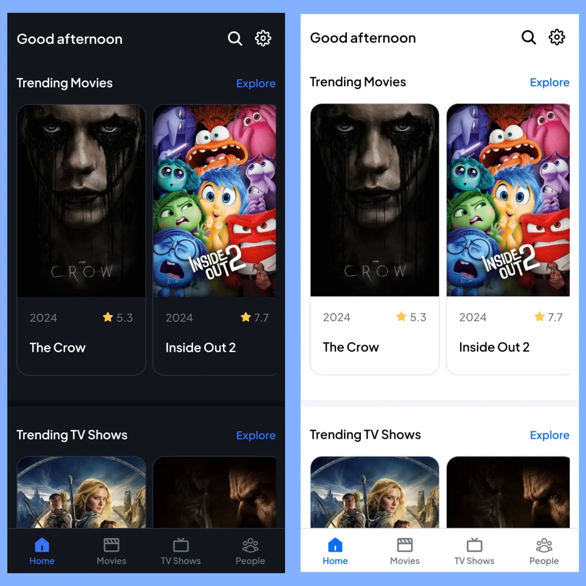

# React + Vite + Express + Axios + TMDB API + PWA

Welcome to the React Movie App! This web application allows users to discover movies, TV shows, actors, and actresses using data from the TMDB API.

## Live Demo

- [https://dibimovie.vercel.app](https://dibimovie.vercel.app/)

## Features

- **Explore**: Browse trending, popular, and upcoming movies, TV shows, actors, and actresses.
- **Search Functionality**: Search for specific movies, TV shows, actors, or actresses.
- **Detailed Information**: Access detailed information about each movie, show, actor, or actress.
- **Responsive Design**: The app is fully responsive, ensuring a great experience on both desktop and mobile devices.

This template provides a minimal setup to get React working in Vite with HMR and some ESLint rules, along with a simple Express server, Axios for making HTTP requests, and integration with The Movie Database (TMDB) API to fetch movie data.

Currently, two official plugins are available:

- [@vitejs/plugin-react](https://github.com/vitejs/vite-plugin-react/blob/main/packages/plugin-react/README.md) uses [Babel](https://babeljs.io/) for Fast Refresh
- [@vitejs/plugin-react-swc](https://github.com/vitejs/vite-plugin-react-swc) uses [SWC](https://swc.rs/) for Fast Refresh

### Additional:
- **[Express](https://github.com/expressjs/express):** A lightweight web framework for handling backend routes and API endpoints. Useful for creating a RESTful API or serving your React application in a production environment.
- **[Axios](https://github.com/axios/axios):** A promise-based HTTP client for the browser and Node.js, integrated into the project for handling API requests. It simplifies making asynchronous HTTP requests to fetch data from APIs or your Express server.
- **[TMDB API](https://developer.themoviedb.org/docs/getting-started):** Utilizes TMDB API to fetch and display movie data such as the latest, popular, and upcoming movies. You can explore detailed movie information, including titles, posters, release dates, and ratings.
- **[Vite PWA](https://vite-pwa-org.netlify.app/):** Configured with Vite PWA for enhanced performance, background updates, and mobile-friendly app installation.
